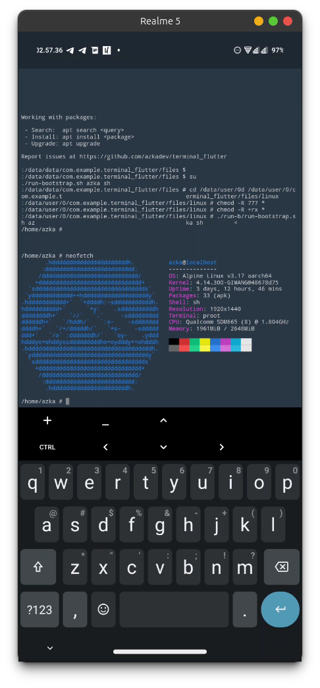
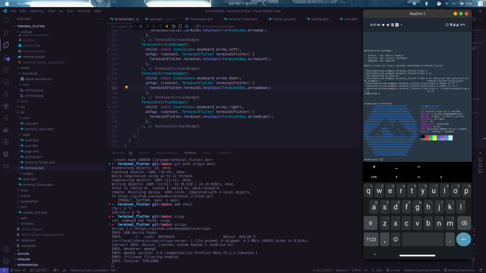

# Terminal Flutter

Terminal Flutter Untuk menambahkan fitur terminal pada flutter app 


## Features
1. [x] Multi shell
2. [x] Cross platform Support (Android, iOS, Linux, macOS, Windows)
3. [x] Custom environment like termux (jika anda tahu chroot / sejenis itu tolong kasih saya petunjuk ya)
4. [x] Plugable Library now you can add terminal in your app

## Linux Distro on Android / Proot / 

1. [Alpine Linux](https://github.com/feelfreelinux/android-linux-bootstrap) **TESTED WORK 100%**
2. Ubuntu Linux
3. Debian Linux

## Install Package

```bash
dart pub add terminal_flutter
```


## Screenshot
New update 2024





Old


