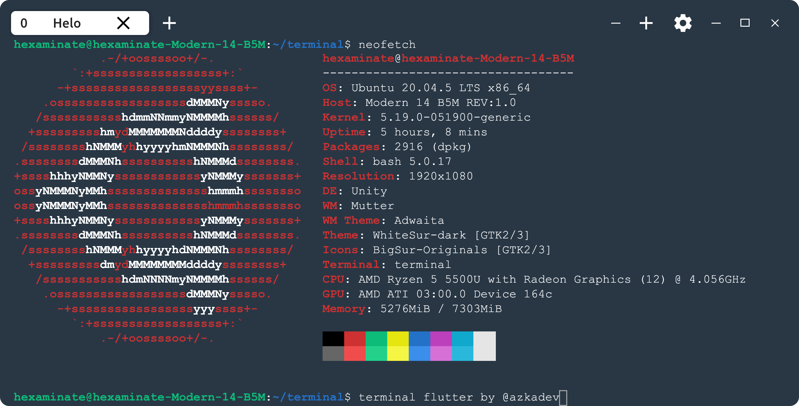

# Terminal

Terminal Native dari flutter



## Features
1. [x] Multi shell
2. [x] Cross platform Support
3. [ ] D


## Develop
1. Clone repo dahulu
```bash
git clone https://github.com/azkadev/terminal.git
cd terminal
```

2. Install Package

```bash
flutter pub get
```


## Screenshot


