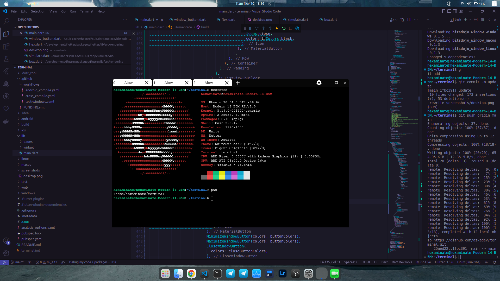
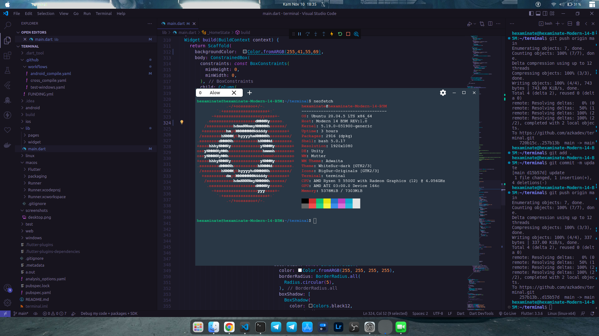

# Terminal Flutter

Terminal Flutter Untuk menambahkan fitur terminal pada flutter app 


## Features
1. [x] Multi shell
2. [x] Bisa Berbagai Platform (Android, iOS, Linux, macOS, Windows)
3. [x] Kustom environment Seperti Termux
4. [x] Library yang gampang sehingga kamu bisa menambahkan fitur ini dengan cepat

## Linux Distro on Android / Proot / 

1. [Alpine Linux](https://github.com/feelfreelinux/android-linux-bootstrap) **TESTED WORK 100%** **Butuh Akses Root**
2. Ubuntu Linux
3. Debian Linux

## Install Package

```bash
dart pub add terminal_flutter
```

## Import libary

## Quick Start

## Screenshot
New update 2024


Old



